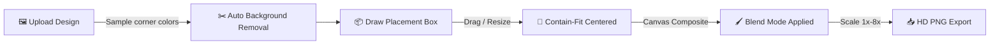

<div align="center">


<br/>

[](https://github.com/Nayeem131136/fitloom)
&nbsp;
[](https://vercel.com)
&nbsp;
[](https://developer.mozilla.org/en-US/docs/Web/HTML)
&nbsp;
[](LICENSE)

<br/>


</div>

---

## 📖 About

**Fitloom** is a free, browser-based mockup generator. Upload any design, drag a placement box onto a product/frame mockup, and the tool automatically fits your artwork into place — with background removal and high-resolution export, all running client-side with zero backend.

> *"Perfect placement shouldn't need Photoshop."*

---

## ✨ Key Features

<div align="center">

| Feature | Description |
|---|---|
| 🖱️ **Drag & Resize Box** | Click-drag placement box with 8-point resize handles — no manual coordinates |
| ✂️ **Auto Background Removal** | Color-distance cutout turns your design into a clean PNG before placing |
| 🎯 **Perfect Auto-Fit** | Design is centered and scaled to fit the exact box you draw |
| 🖼️ **Multi-Mockup Support** | 3 built-in mockups + upload your own custom mockup on the fly |
| 🎚️ **Blend Modes** | Normal / Multiply blending for realistic shadow interaction |
| 📸 **HD Export** | 1x / 2x / 4x / 8x scale PNG download, ready for print or social |
| 🎨 **Animated UI** | Gradient nav, floating blobs, scroll-reveal — Magic UI-style motion |
| ⚡ **No Backend, No Signup** | 100% static — runs entirely in the browser |

</div>

---

## 🛠️ Tech Stack

<div align="center">


</div>

---

## 🏗️ Project Structure

```
fitloom/
├── 🎨 index.html          # Everything — landing page + generator (single file)
│   ├── <style>            # Design tokens, animations, layout
│   ├── <body>              # Nav → Hero → Features → Generator → Footer
│   └── <script>            # Drag/resize box, bg-removal, canvas compositing
├── 📄 README.md
└── 🚫 .gitignore
```

---

## 🔄 How It Works



---

## ⚙️ Installation & Setup

```bash
# 1. Clone the repository
git clone https://github.com/Nayeem131136/fitloom.git
cd fitloom

# 2. Just open it — no build step, no dependencies
open index.html   # macOS
start index.html  # Windows
```

That's it. No `npm install`, no server, no `.env`.

---

## 🚀 Deploy Your Own

```bash
# Push to GitHub
git init
git add .
git commit -m "Initial commit: Fitloom"
git branch -M main
git remote add origin https://github.com/Nayeem131136/fitloom.git
git push -u origin main
```

Then on **[vercel.com/new](https://vercel.com/new)**:
1. Import the `fitloom` repo
2. Framework preset → **Other** (static site, no build command)
3. Click **Deploy** 🚀

Every push to `main` auto-redeploys.

---

## 🧭 Usage

| Step | Action |
|---|---|
| 1️⃣ | Pick a built-in mockup or upload your own |
| 2️⃣ | Drag the green box onto the frame area, resize with the corner handles |
| 3️⃣ | Upload your design — background is auto-removed |
| 4️⃣ | Choose blend mode + export scale (up to 8x HD) |
| 5️⃣ | Click **Generate**, then **Download PNG** |

---

## 🗺️ Roadmap

- [ ] Server-side background removal (remove.bg / Photoroom API) for photo backgrounds
- [ ] Perspective/angled placement (not just axis-aligned box)
- [ ] Save & load mockup presets (needs auth + database)
- [ ] Batch export — multiple designs × multiple mockups at once

---

## 👤 Developer

<div align="center">

| Name | Role | GitHub |
|---|---|---|
| **Md. Mahdi Hasan Nayeem** | 🏆 Creator & Developer | [@Nayeem131136](https://github.com/Nayeem131136) |

**Portfolio:** [mahdi-hasan-nayeem-portfolio.vercel.app](https://mahdi-hasan-nayeem-portfolio.vercel.app/)

</div>

---

<div align="center">


**⭐ Star this repo if it helped you! | 🍴 Fork to build your own**

[](https://github.com/Nayeem131136/fitloom/stargazers)
&nbsp;
[](https://github.com/Nayeem131136/fitloom/network/members)

*Built with 🎨 by Md. Mahdi Hasan Nayeem*

</div>
