<div align="center">


<br/>

[](https://github.com/Nayeem131136/CareCompass)
&nbsp;
[](https://djangoproject.com)
&nbsp;
[](https://python.org)
&nbsp;
[](LICENSE)

<br/>


</div>

---

## 📖 About

**CareCompass** is a real-time, AI-powered humanitarian aid coordination platform built for Bangladesh. It bridges the critical gap between citizens who witness people in need, NGOs with resources, and volunteers willing to help — creating a seamless, transparent ecosystem where **seeing a need directly leads to providing help.**

> *"Technology in service of humanity — connecting every act of compassion with those who need it most."*

---

## ✨ Key Features

<div align="center">

| Feature | Description |
|---|---|
| 📍 **GPS-Based Reporting** | Citizens submit real-time reports with location, photos & category tags |
| 🤖 **AI Urgency Scoring** | Automatically prioritizes reports by severity (medical, food, shelter) |
| 🔔 **Real-Time Alerts** | Instant notifications to nearby NGOs & volunteers via in-app alerts |
| 👥 **Role-Based Access** | Separate dashboards for Reporter, Volunteer, NGO & Admin |
| 🗺️ **Google Maps Integration** | Interactive map for location selection & viewing active reports |
| 🏆 **Leaderboard System** | Gamified engagement for top contributors & volunteers |
| ✅ **Proof of Completion** | File/image upload to verify aid delivery |
| 📊 **Analytics Dashboard** | Heatmaps & trend analysis for administrators |
| 🌐 **Bilingual Interface** | Bengali & English language toggle |

</div>

---

## 🛠️ Tech Stack

<div align="center">


</div>

---

## 🏗️ System Architecture

```
CareCompass/
├── 🏠 accounts/          # User auth & role management
│   ├── models.py         # Reporter, Volunteer, NGO, Admin models
│   └── views.py          # Login, register, profile views
├── 📋 reports/           # Core reporting system
│   ├── models.py         # Report model (GPS, AI score, status)
│   └── views.py          # Submit, list, accept, complete
├── 🏆 leaderboard/       # Gamification & rankings
├── 🔔 notifications/     # Real-time alert engine
├── 📊 analytics/         # Dashboard & heatmaps
└── 🌐 templates/         # Bilingual UI (EN/BN)
```

---

## 🚦 User Roles & Workflow

```mermaid
graph LR
    A[👤 Citizen Reports] -->|GPS + Photo| B[📋 Report Created]
    B -->|AI Scores Urgency| C[🤖 Priority: HIGH/MED/LOW]
    C -->|Real-time Alert| D[🏢 NGO / Volunteer]
    D -->|Accept Assignment| E[🚗 En Route]
    E -->|Upload Proof| F[✅ Completed]
    F -->|Data Aggregated| G[📊 Admin Analytics]
```



---

## ⚙️ Installation & Setup

```bash
# 1. Clone the repository
git clone https://github.com/Nayeem131136/CareCompass.git
cd CareCompass

# 2. Create virtual environment
python -m venv venv
source venv/bin/activate  # Windows: venv\Scripts\activate

# 3. Install dependencies
pip install -r requirements.txt

# 4. Apply migrations
python manage.py makemigrations
python manage.py migrate

# 5. Create superuser
python manage.py createsuperuser

# 6. Run the server
python manage.py runserver
```

Then visit: `http://127.0.0.1:8000`

**Test Credentials:**
| Role | Username | Password |
|---|---|---|
| User | `user` | `user@123` |
| NGO | `ngo` | `user@123` |
| Volunteer | `volunteer` | `user@123` |

---

## 🧪 Running Tests (Selenium E2E)

```bash
# Install test dependencies
pip install selenium webdriver-manager pyhtmlreport

# Run full test suite
python comprehensive_test_suite.py

# Tests cover:
# ✅ User registration & login
# ✅ Report submission
# ✅ NGO accept/reject flow
# ✅ Volunteer proof upload
# ✅ Leaderboard display
```

---

## 📐 UML Diagrams

<details>
<summary>📌 Use Case Diagram</summary>

The system identifies **5 actors**: Reporter, NGO Staff, Volunteer, Admin, Notification Service — each with specific use cases connected via `<<include>>` and `<<extend>>` relationships.

</details>

<details>
<summary>📌 DFD Level-0 & Level-1</summary>

Level-0 treats CareCompass as a black box showing data flows between Citizens, NGOs/Volunteers, and Admin.
Level-1 breaks it into: Report Management → AI Scoring → Notification & Assignment → Analytics & Reporting.

</details>

<details>
<summary>📌 ERD</summary>

Core entities: **Reporter, Report, Assignment, Volunteer, NGO_Staff, Admin, Feedback, ActivityVerification, Photo**

</details>

---

## 📅 Agile Sprint Timeline

| Sprint | Week | Focus |
|---|---|---|
| Sprint 1 | Week 1 | Project setup, homepage, base template |
| Sprint 2 | Week 2 | User auth, role-based access |
| Sprint 3 | Week 3 | Role-specific dashboards |
| Sprint 4 | Week 4 | Report submission & listing |
| Sprint 5 | Week 5 | Report details & acceptance workflow |
| Sprint 6 | Week 6 | Leaderboard & UI enhancements |
| Sprint 7 | Week 7 | Google Maps integration & proof submission |
| Sprint 8 | Week 8 | Profile management & final polish |

---

## 👥 Team

<div align="center">

| Name | ID | Role | GitHub |
|---|---|---|---|
| **Md. Mahdi Hasan Nayeem** | 22201131 | 🏆 Team Leader & Lead Dev | [@Nayeem131136](https://github.com/Nayeem131136) |
| Rupasha Khan Tandra | 22201136 | Developer | [@tandra136131](https://github.com/tandra136131) |
| Ankita Hossain Anushka | 22201130 | Developer | [@ankitahossain](https://github.com/ankitahossain) |

**Course:** CSE 314 — Software Engineering Lab
**Instructor:** Jayonto Dutta Plabon, Lecturer, CSE — University of Asia Pacific

</div>

---

## 🌍 Social Impact

CareCompass addresses Bangladesh's critical challenges:
- 🏚️ **Urban homelessness** — rapid urbanization in Dhaka
- 🌊 **Climate refugees** — annual flood displacement
- 🤝 **NGO coordination gap** — duplicated efforts & wasted resources
- 📊 **Data-driven policy** — verified heatmaps for government planning

---

<div align="center">


**⭐ Star this repo if it helped you! | 🍴 Fork to contribute**

[](https://github.com/Nayeem131136/CareCompass/stargazers)
&nbsp;
[](https://github.com/Nayeem131136/CareCompass/network/members)

*Built with ❤️ for Bangladesh | CSE 314 — University of Asia Pacific*

</div>
